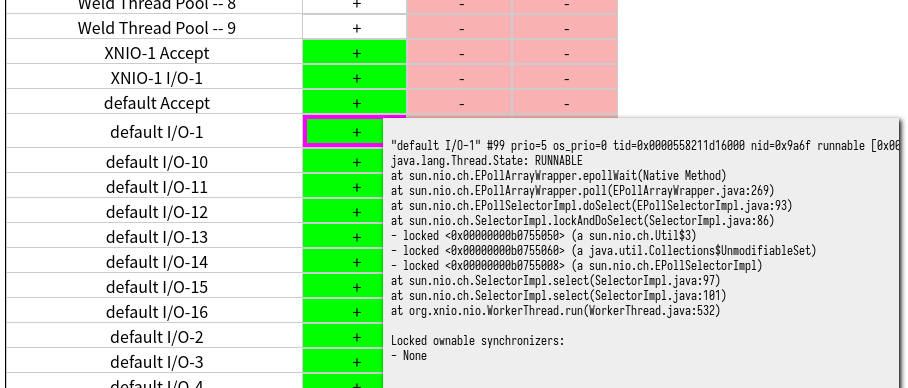

# py-shougun

`py-shougun` takes Java thread dumps created by `jstack` and creates a static HTML site to help with analysis.

This program is inspired by [侍 (samurai)](https://github.com/yusuke/samurai/) which it a great tool but can grind to a halt with a large number of thread dumps.
`py-shougun` was tested and seems to work just fine with thread dump files over 80MB, containing over 70,000 separate stack dumps.

## Sample

Running the script will create a static HTML site in the `output` directory containing an HTML, CSS, and Javascript files.

Opening the HTML file will show a large table with each thread on a separate row and times as columns.
Clicking on a cell will show the stack trace for that thread.

## Installation

`py-shougun` should be run on Python 3.10+.

1. Download the source to a local directory.
2. Run `pip3 install --user -e .` to install `py-shougun` to the local user install directory.
3. Run `shougun --help` to view command line options.
